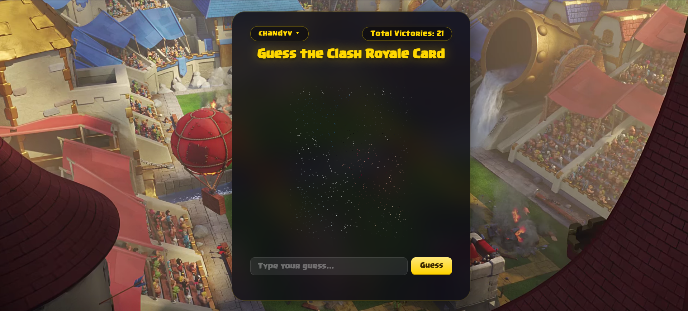

# Clashdle



A Wordle-style guessing game for Clash Royale cards. You get a pixelated card image and have to guess which one it is — each wrong guess reveals a bit more of the picture.

Built this mostly to learn web dev: React on the frontend, Express + MongoDB on the backend, cookie-based auth with JWTs, etc.


## Running it

```bash
# frontend
npm install
npm start

# backend (separate terminal)
cd server
npm install
npm start
```

You'll need a `.env` in `/server` with `MONGO_URI` and `JWT_SECRET`.
